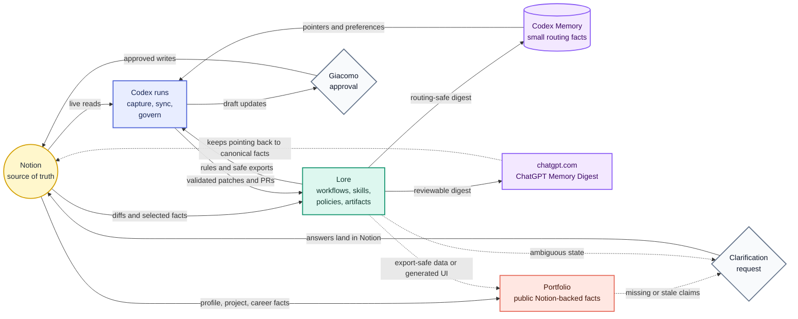

  <!-- Logo slot: add assets/logo.png, assets/logo.svg, or light/dark logo variants here. -->

<h1 align="center">Lore</h1>

  <strong>Agent infrastructure for a Notion-first knowledge system.</strong> 
  Workflows, skills, policies, and reviewable artifacts for Giacomo's Notion workspace.

  
  

 

Lore keeps agents pointed at the right source of truth. Notion owns the actual personal knowledge, tasks, projects, and portfolio facts; this repo keeps the supporting workflows and artifacts that make that workspace usable by Codex, ChatGPT, and other agents.

Generated files under `dist/` are reviewable outputs, not canonical records.

## Workflow Map

Lore sits between the canonical Notion workspace and the agents that need safe,
scoped context from it.

## What's Inside

- `skills/`: repo-owned agent workflows.
- `docs/workflows.md`: the accepted workflow map.
- `docs/agents/`: navigation and issue-tracker guidance for agents.
- `docs/adr/`: durable policy decisions.
- `dist/`: generated snapshots, reports, digests, and context packs.

## Principles

- Notion is canonical.
- Lore defines workflows; external runtimes execute them.
- Agents narrow-load only the docs or artifacts needed for the task.
- Codex memory should keep routing facts and preferences, not Notion content.
- Public artifacts must not include private Notion material without explicit approval.

## Contributing

Free and open source under the [MIT License](LICENSE). See [CONTRIBUTING.md](.github/CONTRIBUTING.md) to get involved.

Agents should start at [AGENTS.md](AGENTS.md).
